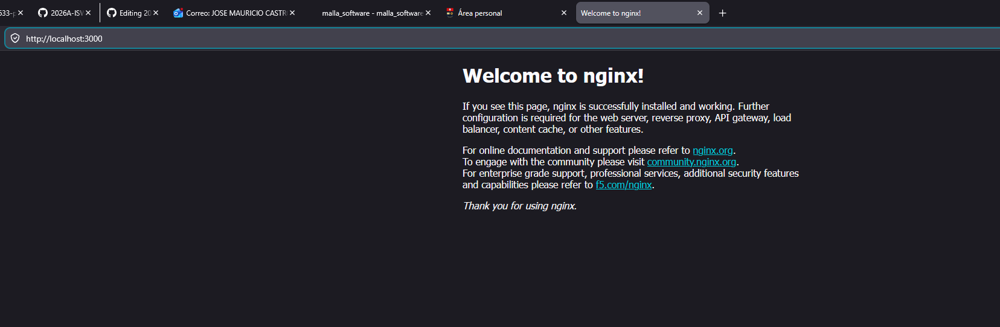
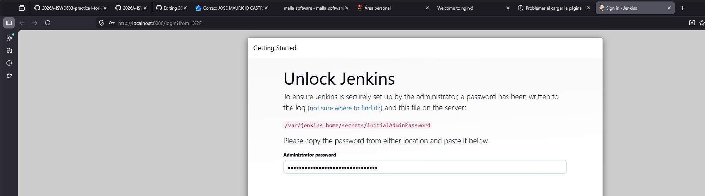

# Mapeo de puertos
El mapeo de puertos es un mecanismo que permite redirigir el tráfico de red desde un puerto en el host (tu máquina local o servidor) hacia un puerto específico en un contenedor Docker.
Por ejemplo, supongamos que tienes un contenedor que ejecuta un servidor web en el puerto 80 dentro del contenedor, pero quieres acceder a ese servidor desde tu navegador en la máquina host. Puedes usar el mapeo de puertos para redirigir el tráfico del puerto 80 del contenedor al puerto 3000 en el host. De esta manera, cuando accedas a http://localhost:3000 en tu navegador, el tráfico se dirigirá al servidor web dentro del contenedor en el puerto 80.


### Para crear un mapeo de puertos (puerto host y puerto contenedor)
El mapeo de puertos se especifica al ejecutar un contenedor Docker utilizando la opción -p o --publish seguida de los puertos que deseas mapear
```
docker run -d --name <nombre contenedor> -p <puerto host>:<puerto contenedor> <nombre imagen>:<tag>

```
Crear un contenedor a partir de la imagen nginx version alpine con el mapeo de puertos del ejemplo gráfico, host 3000 y contenedor 80

```
PS C:\Users\Usuario> docker run -d --name srv-web3 -p 3000:80 nginx:alpine-perl
1282d469d8269090779fc5538ecfa32b74c0fcb84ace67ea51c4d2fbc85ea9fd
```



### Para mapear más de un puerto

```
docker run -d --name <nombre contenedor> -p <puerto host 01>:<puerto contenedor 01> -p <puerto host 02>:<puerto contenedor 02> <nombre imagen>:<tag>
```

Crear un contenedor a partir de la imagen rabbitmq version management-alpine, para este mapeo de puertos usar en el host los mismos puertos del contenedor.
```
PS C:\Users\Usuario> docker run -d --name conejo -p 3002:80 -p 3003:80 rabbitmq:alpine
c076ad1279eed49b627fb2e258854aa4fabc3e5b9c971b79b239df56c16aca47
```
### Usando una forma más semántica cuando se especifican puertos

```
docker run -d --name <nombre contenedor> --publish published=<valorPuertoHost>,target=<valor> <nombre imagen>:<tag> 
```
### Publicando todos los puertos
```
docker run -P -d --name <nombre contenedor> <nombre imagen>:<tag> 
```

-P: le indica a Docker que asigne automáticamente puertos aleatorios en tu host para todos los puertos expuestos por el contenedor.

**Recordar**
No puedes mapear puertos a un contenedor existente directamente después de su creación con Docker. El mapeo de puertos debe especificarse en el momento de crear y ejecutar el contenedor.

### Crear contenedor de Jenkins puertos contenedor: 8080 (interface web) y 50000 (comunicación entre nodos) imagen: jenkins/jenkins:lts

```
PS C:\Users\Usuario> docker run -d --name jjk -p 8080:8080 -p 5000:50000 jenkins/jenkins:2.555.1-lts
f3d9c7aa0386f476de9ec35788d9343851df154e3463939938bd49f86c3495e3
```



### ¿Cómo obtener la contraseña solicitada?
Para obtener la contraseña solicitada es necesario ingresar al contenedor.


